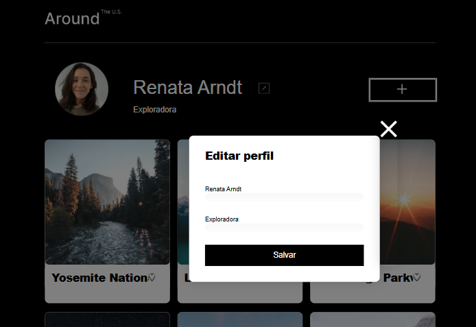
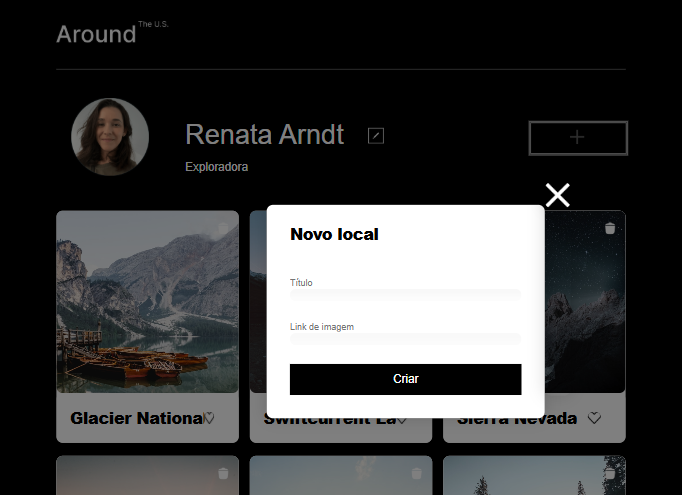
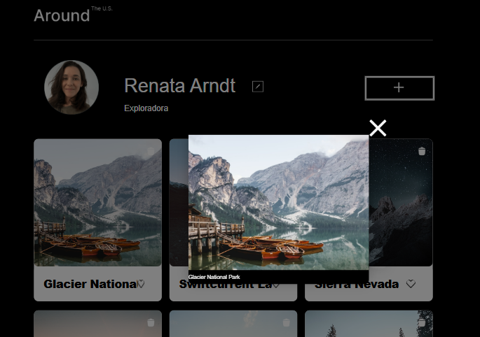
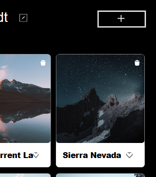
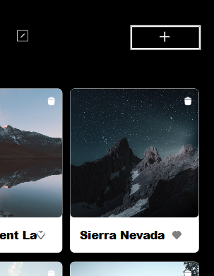

# Tripleten web_project_around

Nesse projeto criamos, pela primeira vez, uma página com interação. 
Usamos HTML para construir a estrutura do site e CSS para estilizar. 
Nesse sprint aprendemos o básico do JavaScript, que para mim foi bastante desafiador, então usamos esses novos conhecimentos para criar um popup interativo no site. Ele aparece conforme clicamos no botão de editar perfil (localizado ao lado do nome). Abaixo coloco alguns prints para demonstrar:

Na segunda parte do projeto, adicionamos:
> o popup com um formulário para adicionar um novo cartão de local, ao clicar no botão "+";

> o popup que abre a imagem completa ao clicar na imagem do cartão;

> adicionamos os cartões através do JS;
> adicionamos o botão de lixeira, que remove os cartões ao clicar nele;

> adicionamos a funcionalidade ao botão curtir (em formato de coração), ao clicar ele muda de cor.

O projeto está no link do gitHub Pages: https://renata-arndt.github.io/web_project_around/